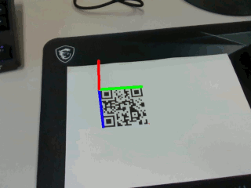
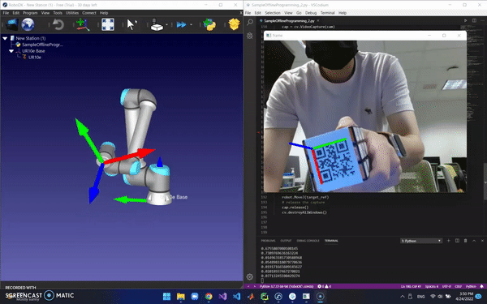

# Vision Control Bot 
**Keyword:** Computer Vision, solvePnP, OpenCV, 3D Reconstruction, Camera Calibration, Forward/Inverse Kinematic, body transformation, robot manipulator 
**Carnegie Mellon University MEG24678 Final Project** 
**Team Members:** Peize Hong, Shaobo Wang, Yicong Xiao, Dajun Tao 
**Environment:** RoboDK IDE, Python 3.7, OpenCV  
**Project Objective:** Use computer vision 3D reconstruction method to control robot manipulator. Robot can follow trajectories created by instructor in the camera 
 
 
Regonized QR code and its orientation and ouput x,y,z, roll, yaw, pitch coordinates 
 
 
Take x,y,z, roll, yaw, pitch coordinates and calculate optimal inverse kinematic 
 
UR10e is used as demo robot 
More details please visit: https://www.peizehong.com/vision-control-bot  
Peize Hong 2022 All Rights Reserved
